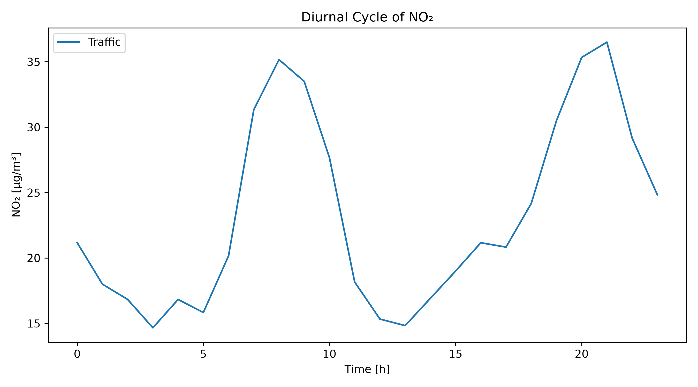
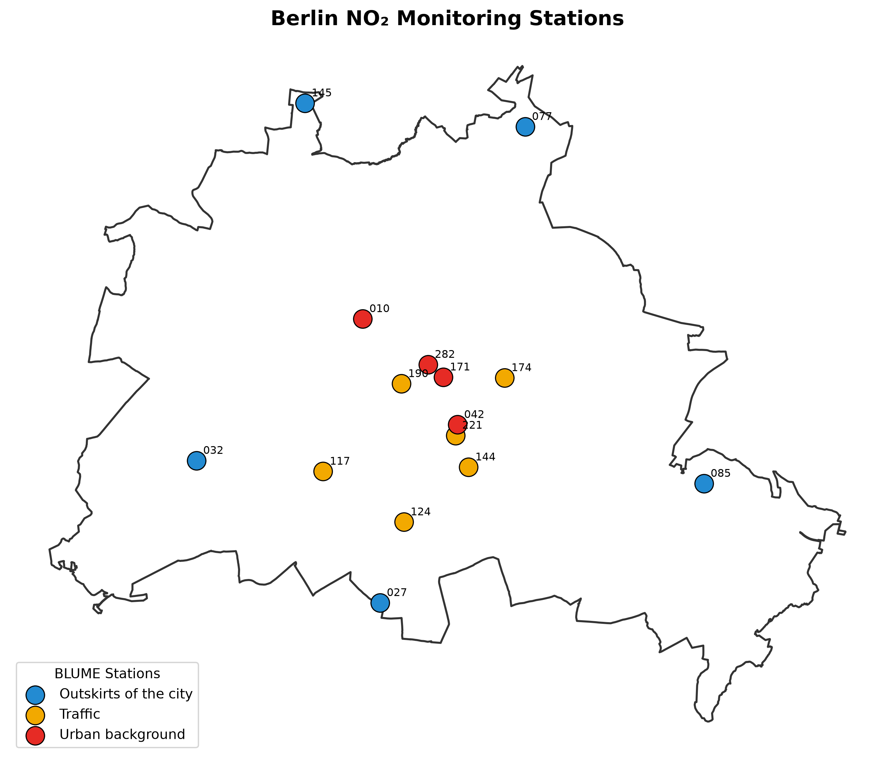
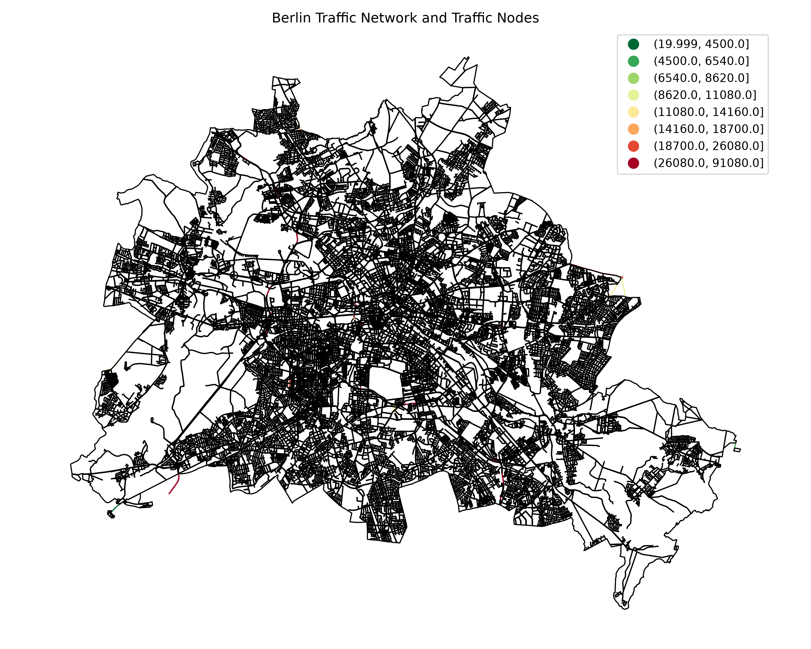
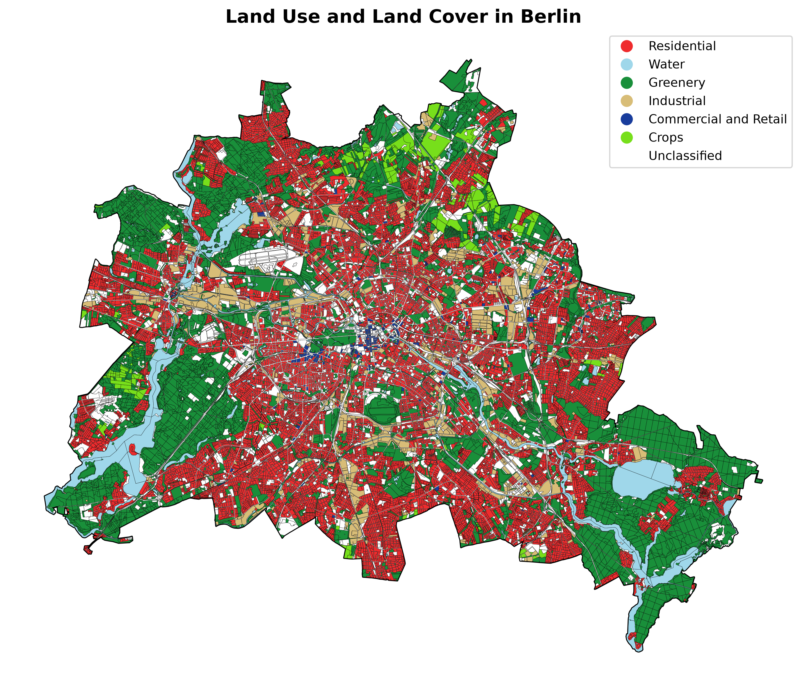
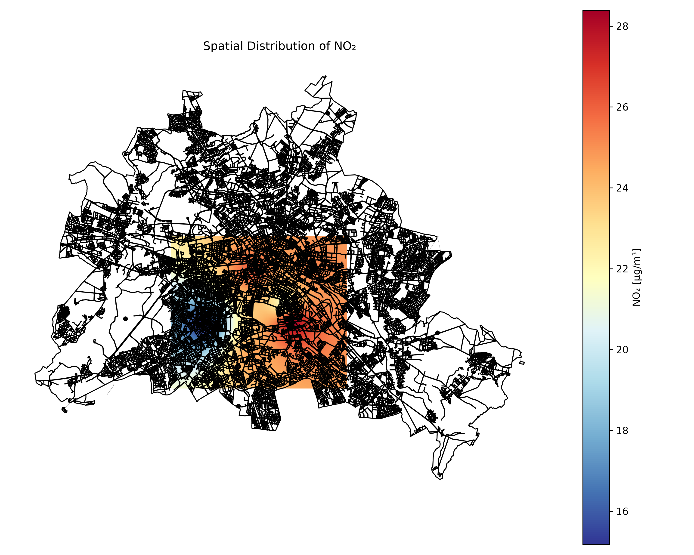
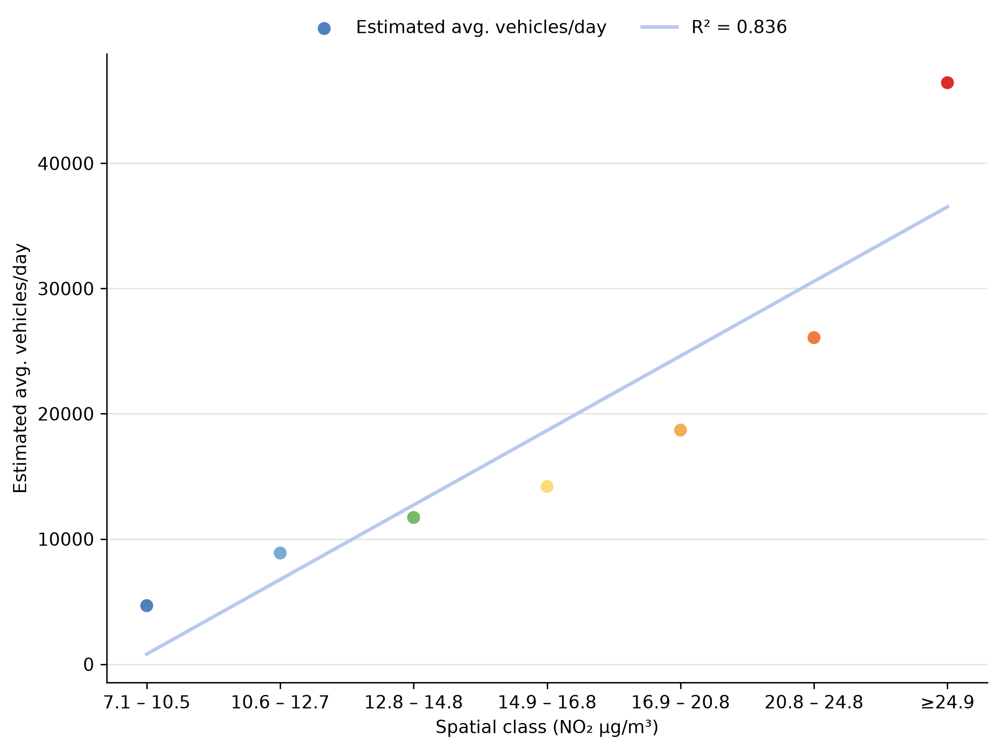

# Urban Air Quality and Mobility in Berlin

This project analyses the spatial distribution of nitrogen dioxide (NO₂) across Berlin and examines its relationship with road traffic and urban land use.

## Study Context

Air pollution is an important environmental and public health issue in urban areas. Nitrogen dioxide (NO₂) is particularly relevant in cities because it is associated with combustion processes and is strongly influenced by road traffic, especially in areas with high traffic intensity.

Berlin provides a useful case study because of its heterogeneous urban structure and the spatial variation in traffic intensity, land use and environmental conditions. NO₂ is monitored across the city through the Berlin Air Quality Monitoring Network (BLUME), providing station based measurements that can be analysed using GIS methods.

The study focuses on two main questions: where are NO₂ concentrations highest across Berlin, and to what extent can road traffic help explain these spatial patterns? To address these questions, annual mean NO₂ measurements from BLUME monitoring stations are combined with traffic volume data and land use information. The NO₂ measurements for 2025 are interpolated using Inverse Distance Weighting (IDW), while traffic intensity is used as a spatial proxy for potential traffic related emission pressure.

## Workflow

    NO₂ measurements
           ↓
    Data preparation
           ↓
    Temporal + spatial analysis
           ↓
    Traffic + land use
           ↓
    IDW interpolation
           ↓
    Validation
           ↓
    Results

## Data

Hourly NO₂ measurements are obtained from the Berlin Air Quality Monitoring Network.

Station information is stored in:

    data/raw/stations.csv

Additional spatial datasets are stored in:

    data/raw/

The main datasets used in the analysis are:

    BLUME station data
    Annual mean NO₂ values (2025)
    Traffic volume roads data (2019)
    Land use / land cover data
    Berlin administrative boundary

Annual mean NO₂ concentrations from 2025 are used as the input for the IDW interpolation.

Traffic intensity is represented by average daily vehicle volumes from the Berlin traffic volume dataset from 2019. The traffic data are used as a proxy for potential traffic related emission pressure rather than as a direct measurement of NO₂ emissions.

Traffic nodes were created by identifying intersections between major road categories, including motorways, primary roads and secondary roads. These nodes highlight locations where traffic interactions and potential congestion are more likely to occur. They do not represent measured NO₂ emissions or measured congestion.

The traffic dataset represents 2019 conditions, while the NO₂ analysis is based on 2025 measurements. The two datasets therefore do not represent exactly the same period.

Land use and land cover data are included to provide additional spatial context for interpreting the distribution of NO₂ across Berlin.

## Run the Project

Install the required Python packages:

    pip install pandas numpy scipy matplotlib geopandas shapely pyproj geopy requests beautifulsoup4

Run the complete workflow:

    python main.py

The workflow consists of:

    1_prepare_data.py
            ↓
    2_analysis.py
            ↓
    3_validation.py
            ↓
    4_export_results.py

## Figures

### Diurnal NO₂ Pattern

Shows the daily variation of NO₂ concentrations for different monitoring station types. On 5 May 2025, a typical weekday, traffic stations recorded the highest concentrations, with a pronounced peak during the morning rush hour, while urban background and outskirts stations followed a similar but notably lower pattern throughout the day. This comparison illustrates how the location and surrounding environment of a monitoring station can influence the NO₂ concentrations measured at that site, with stations located close to traffic capturing stronger local pollution signals.

### Monitoring Stations

Shows the locations and categories of the NO₂ monitoring stations used in the analysis.

### Traffic Network

Shows the Berlin road network, traffic intensity and traffic nodes used in the analysis. Traffic nodes provide additional spatial context by highlighting intersections between major road categories.

### Land Use

Shows the main land use and land cover categories across Berlin and provides spatial context for interpreting NO₂ patterns.

### Spatial Distribution of NO₂

Shows the annual 2025 NO₂ distribution interpolated from BLUME monitoring stations using Inverse Distance Weighting (IDW).

The resulting spatial distribution reveals a distinct concentric pattern, with higher NO₂ concentrations concentrated in the central districts and gradually decreasing towards the peripheral areas of Berlin. The highest concentrations range from 20.8 to over 24.9 µg/m³ and are mainly concentrated in the central part of the city. In contrast, the lowest concentrations range from 7.1 to 12.7 µg/m³ and are predominantly found towards the outer fringes of Berlin and in greener areas.

### Traffic and NO₂ Validation

Shows the relationship between NO₂ concentration classes and estimated average daily traffic.

To validate the extent to which road traffic explains these observed spatial patterns, the interpolated
NO2 layers were correlated against the estimated average daily traffic volume.

## Interpretation

The spatial analysis identifies higher NO₂ concentrations in central and inner urban areas and lower concentrations towards the peripheral and greener areas of Berlin.

The traffic analysis shows that areas associated with higher NO₂ concentration classes also tend to have higher estimated average daily traffic. The validation analysis reports an R² value of 0.836 for the relationship between NO₂ concentration classes and estimated traffic volume.

This relationship should be interpreted as an association between spatial traffic intensity and interpolated NO₂ concentrations rather than as evidence that traffic alone determines the observed concentrations. Other factors influence NO₂ distribution, including residential and commercial heating, industrial activity, urban form, street geometry, vegetation and atmospheric conditions.

## Limitations

The spatial interpolation is based on a relatively small number of monitoring stations, which limits the spatial resolution of the resulting NO₂ surface.

The use of 2019 traffic data alongside 2025 NO₂ measurements introduces a temporal mismatch between the traffic proxy and the pollution measurements. Traffic volume should therefore not be interpreted as a direct measurement of NO₂ emissions at each location.

The traffic dataset represents potential traffic related emission pressure and does not directly measure the amount of NO₂ emitted or the actual contribution of traffic at each location.

The analysis also does not incorporate meteorological variables such as wind speed or temperature inversions, which can influence pollutant dispersion and short term pollution variability.
A comparative analysis between our IDW interpolated ground data and the CAMS satellite based can also be conducted to reveals insights into the scale and precision of air quality monitoring stations.

## Repository Structure

    Urban-Air-Quality-and-Mobility-Berlin/
    │
    ├── README.md
    ├── main.py
    │
    ├── python/
    │   ├── config.py
    │   ├── functions.py
    │   ├── 1_prepare_data.py
    │   ├── 2_analysis.py
    │   ├── 3_validation.py
    │   └── 4_export_results.py
    │
    ├── data/
    │   ├── README.md
    │   └── raw/
    │       ├── stations.csv
    │       ├── no2.csv
    │       ├── traffic.gpkg
    │       ├── landuse.gpkg
    │       └── berlin_boundary.gpkg
    │
    └── figures/
        ├── 01_diurnal_no2.png
        ├── 02_station_map.png
        ├── 03_traffic_network.png
        ├── 04_landuse.png
        ├── 05_no2_idw.png
        └── 07_traffic_no2_validation.png
